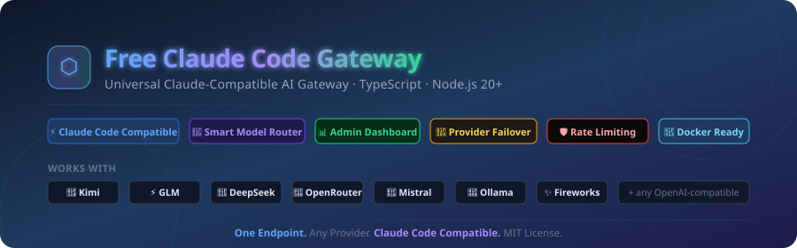
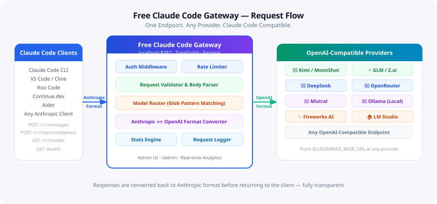
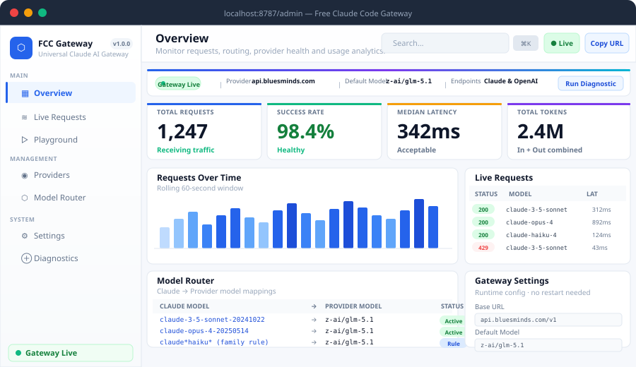

<div align="center">



# Free Claude Code

**Use Claude Code for free — run it with Kimi, GLM, DeepSeek, OpenRouter and any OpenAI-compatible provider**

Run Claude Code without an Anthropic API key. Point it at any free or low-cost AI provider through a single Claude-compatible endpoint.

[](https://opensource.org/licenses/MIT)
[](https://nodejs.org/)
[](https://www.typescriptlang.org/)
[](https://expressjs.com/)
[](https://github.com/rajakumar865465/Free-Claude-Code-Gateway/actions)

[Quick Start](#-quick-start) · [Providers](#-supported-providers) · [Admin Dashboard](#-admin-dashboard) · [Client Setup](#-connect-your-tools) · [Running Locally](#-running-locally) · [API Reference](#-api-reference)

</div>

---

## Use Claude Code for Free

**Free Claude Code Gateway** lets you use the Claude Code CLI, VS Code extensions (Cline, Roo Code), Continue.dev, and any Anthropic-compatible tool — without paying for an Anthropic API key. Instead, it routes your Claude Code requests to free or affordable AI providers like Kimi, GLM, DeepSeek, or OpenRouter.

> **Free Claude Code · Claude Code without API key · Claude Code alternative · Claude Code proxy**

This is a community-built open-source tool. It is **not** affiliated with Anthropic. If you can afford Claude Code, [please support Anthropic and buy it](https://claude.ai/download) — this project is for developers who cannot.

```
Claude Code CLI            Free Claude Code Gateway          Free/Cheap Provider
Cline / Roo Code    ──▶    POST /v1/messages          ──▶    Kimi / GLM / DeepSeek
Continue.dev               POST /v1/chat/completions          OpenRouter (free tier)
Any Anthropic Client       Admin UI at /admin                 Any OpenAI-compatible API
```

Free Claude Code Gateway is an **open-source TypeScript proxy** that sits between Claude Code (and any Anthropic-compatible client) and your chosen AI provider. It accepts requests in the Anthropic Messages API format and converts them to OpenAI-compatible format before forwarding to any provider you configure — then converts the response back. Fully transparent.

```
Claude Code CLI            Free Claude Code Gateway          Your Provider
Cline / Roo Code    ──▶    POST /v1/messages          ──▶    Kimi / GLM / DeepSeek
Continue.dev               POST /v1/chat/completions          OpenRouter / Mistral
Any Anthropic Client       Admin UI at /admin                 Any OpenAI-compatible API
```

## ⚠️ Responsible Use & Legal Notice

This project is built **by the community, for the community** — specifically for developers who want to use the Claude Code interface with alternative AI providers they already have access to.

**Please read before using:**

- This gateway **does not bypass, crack, or circumvent** Anthropic's systems in any way. It is a standard API format converter — the same thing any OpenAI-compatible client library does.
- You are responsible for complying with the terms of service of **both Anthropic and your chosen upstream provider**.
- This project is **not affiliated with, endorsed by, or supported by Anthropic**.
- We do **not** condone using this tool to abuse free tiers, violate provider rate limits, or circumvent usage policies.
- If you use Claude Code professionally or can afford a subscription, **please support Anthropic by purchasing Claude Code** — it funds the research and engineering that makes Claude great.

### 💙 Support Anthropic — Buy Claude Code

If this gateway is useful to you and you can afford it, the right thing to do is support the people who built Claude:

**→ [Get Claude Code (Official)](https://claude.ai/download)** — Anthropic's official Claude Code subscription

**→ [Anthropic Pricing](https://www.anthropic.com/pricing)** — View all plans and options

This project exists for students, hobbyists, developers in regions where pricing is prohibitive, and open-source contributors who want to experiment with Claude-compatible tooling using providers they already pay for. It is **not** a way to get Claude for free — you are using a different AI model from a different provider. The Claude Code interface is just the client.

---

## Architecture

<div align="center">

</div>

---

## ✨ What You Get

- **`POST /v1/messages`** — Full Claude/Anthropic-compatible endpoint. Validates, converts, routes, and returns Anthropic-format responses.
- **`POST /v1/chat/completions`** — OpenAI-compatible passthrough with server-side key injection.
- **`GET /v1/models`** — Lists models from your configured upstream provider.
- **Smart Model Router** — Glob pattern family rules + exact mappings. Auto-Map feature detects prefix style (`vendor/model` vs bare `model`) and auto-suggests the correct provider ID with one click.
- **Full Streaming** — Server-Sent Events with `message_start`, `content_block_*`, `message_delta`, `message_stop` — exactly what Claude Code expects.
- **Tool Calling** — Anthropic `tools` / `tool_use` / `tool_result` ↔ OpenAI `tools` / `tool_calls` bidirectional conversion.
- **Admin Dashboard** — Full SPA at `/admin` with real-time analytics, request monitoring, model router management, playground, and diagnostics.
- **Data Persistence** — Request history, config overrides, and model mappings survive restarts.
- **Runtime Config** — Update provider URL, API key, rate limits, and timeouts from the Admin UI without restarting.
- **Easy to Deploy** — Docker, Docker Compose, PM2, and Nginx configs included.
- **Safe Logging** — API keys and auth headers always redacted. Zero sensitive data in logs.

---


## ⚡ Intelligent Failover & Resilience

When you use free or low-cost inference providers, upstream instability (like 504 Gateway Timeouts or 503 Service Unavailable errors) is common. The Free Claude Code Gateway includes a robust, enterprise-grade resilience system to ensure your workflow is never interrupted.

### 🛡️ Model Fallback Cascade
If the primary mapped model (e.g., deepseek-ai/deepseek-v4.1-flash) fails to respond due to a timeout, the gateway will automatically **cascade** the request to a fallback model. 
- **Family Rules Backup:** Each model family (Opus, Sonnet, Haiku) can define its own specific backup model.
- **Default Fallback Model:** If no backup rule exists, the gateway safely routes the request to your configured **Default Fallback Model** (e.g., moonshotai/kimi-k3).
- **Zero-Downtime:** The client application (like Claude Code) is unaware of the failure—the proxy seamlessly saves the request and returns the response from the fallback model.

### 🔌 Circuit Breaker & Stream Fallbacks
The gateway implements a continuous **Circuit Breaker** on all upstream routes.
- **Auto-Trip:** If a provider fails multiple times in a row, the circuit opens, instantly re-routing traffic to your backup models without waiting for timeouts.
- **Stream Fallbacks:** If a provider's streaming endpoint is broken but their non-streaming endpoint works, the gateway will detect this, fetch the non-streaming response, and **synthesize a fake stream** back to Claude Code so your editor doesn't crash.
- **Graceful Recovery:** The circuit periodically tests the failing provider in a "half-open" state and restores traffic automatically when it stabilizes.

---

## 🚀 Quick Start

### Prerequisites

- Node.js 20 or newer
- An API key from any OpenAI-compatible provider

### 1. Clone & Install

```bash
git clone https://github.com/rajakumar865465/Free-Claude-Code-Gateway.git
cd Free-Claude-Code-Gateway
npm install
```

### 2. Configure

```bash
cp .env.example .env
```

Edit `.env`:

```env
BLUESMINDS_API_KEY=sk-your-provider-api-key
BLUESMINDS_BASE_URL=https://api.moonshot.cn/v1
PORT=8787
DEFAULT_MODEL=moonshotai/kimi-k2
```

### 3. Start

```bash
npm run dev        # Development with live reload
npm run build      # Compile TypeScript
npm start          # Production
```

The gateway starts and prints:

```
Free Claude Code Gateway v1.0.0 listening on http://localhost:8787
Admin dashboard: http://localhost:8787/admin
```

**That's it.** Point Claude Code at `http://localhost:8787` and start coding.

---

## 🔌 Supported Providers

The gateway works with **any OpenAI-compatible API endpoint**. Just set `BLUESMINDS_BASE_URL` and `BLUESMINDS_API_KEY`:

| Provider | Base URL | Notes |
|---|---|---|
| **Kimi (MoonShot)** | `https://api.moonshot.cn/v1` | `kimi-k2`, `moonshot-v1-8k` |
| **GLM / Z.ai** | `https://api.z.ai/api/paas/v4` | `glm-5.1`, `glm-5-turbo` |
| **DeepSeek** | `https://api.deepseek.com/v1` | `deepseek-chat`, `deepseek-coder` |
| **Databricks** | `https://<workspace>.databricks.com/ai-gateway/mlflow/v1` | `system.ai.glm-5-2`, `databricks-meta-llama-3-70b-instruct` |
| **OpenRouter** | `https://openrouter.ai/api/v1` | Access 100+ models via one key |
| **Mistral** | `https://api.mistral.ai/v1` | `mistral-large`, `devstral-small` |
| **Fireworks AI** | `https://api.fireworks.ai/inference/v1` | `llama-v3p3-70b-instruct` |
| **Cerebras** | `https://api.cerebras.ai/v1` | Ultra-fast inference |
| **Groq** | `https://api.groq.com/openai/v1` | `llama-3.3-70b`, `gemma2-9b` |
| **LM Studio** | `http://localhost:1234/v1` | Local models |
| **Ollama** | `http://localhost:11434/v1` | Any Ollama model |
| **Any OpenAI-compat** | your URL | Self-hosted, vLLM, llama.cpp, etc. |

> 🆕 **New:** Databricks is now supported as a first-class provider type! See the [Databricks Setup Guide](docs/DATABRICKS_SETUP.md) for configuration details.

### Configure Model Mappings

Edit `config/models.json` to map Claude model names to your provider's models:

```json
{
  "anthropic_to_bluesminds": {
    "claude-opus-4-5-20251101": "moonshotai/kimi-k2",
    "claude-3-5-sonnet-latest":   "moonshotai/kimi-k2",
    "claude-opus-4-20250514":     "moonshotai/kimi-k2",
    "claude-haiku-4-20250514":    "moonshotai/kimi-k2"
  },
  "default": "moonshotai/kimi-k2",
  "family_rules": [
    { "name": "Sonnet", "pattern": "claude*sonnet*", "primary": "moonshotai/kimi-k2" },
    { "name": "Haiku",  "pattern": "claude*haiku*",  "primary": "moonshotai/kimi-k2" },
    { "name": "Opus",   "pattern": "claude*opus*",   "primary": "moonshotai/kimi-k2" },
    { "name": "Default","pattern": "*",              "primary": "moonshotai/kimi-k2" }
  ]
}
```

**Resolution order:** Exact match → Family rule (glob) → Pass-through (non-strict) → Default → Error (strict mode)

You can also manage all mappings live from the **Admin Dashboard → Model Router** without editing files.

### Auto-Map — Fix Provider ID Format in One Click

OpenAI-compatible providers are inconsistent about model ID format. Some return `moonshotai/kimi-k2.6` (vendor prefixed), others return `kimi-k2.6` (bare name). This causes the UNSAVED status in the Model Router when you switch providers.

**Auto-Map solves this automatically:**

```
Your mapping table:                     Provider returns:
claude-3-5-sonnet  →  kimi-k2.6        moonshotai/kimi-k2.6  ← different format
claude-opus-4      →  kimi-k2.6        kimi-k2.5
                                        glm-4.6
                                        gpt-4o
```

**How to use it:**

1. Go to **Admin Dashboard → Model Router**
2. Click **Sync Models** — fetches the live model list from your provider
3. Click **Auto-Map** (unlocks after sync) — scores every row against the model list
4. Yellow badges appear showing the suggested correct ID: `→ moonshotai/kimi-k2.6`
5. Click **Apply N suggestions** to fix all rows at once
6. Click **Save Router** to persist

**How the scoring works:**

The matcher normalizes both sides — strips vendor prefixes, strips suffixes like `-latest`/`-preview`, collapses separators — then scores on multiple signals:

| Signal | Score |
|---|---|
| Exact raw match (`glm-4.6` = `glm-4.6`) | 1.0 |
| Same name after stripping vendor prefix | 0.9 |
| Same name after stripping suffixes | 0.85 |
| Token similarity (Jaccard on `-`-split tokens) | 0–0.7 |
| Vendor alias bonus (`moonshotai` ↔ `kimi`) | +0.1 |

Only suggestions with **confidence ≥ 0.75** are shown. A green **✓ Correct** badge appears when your current mapping already uses the right format.

The Provider Model input field also gets **autocomplete** — start typing and see all synced models as options.

---

## 🖥 Admin Dashboard

<div align="center">

</div>

Access at `http://localhost:8787/admin`. A full SPA with 7 views:

| View | What You Get |
|---|---|
| **Overview** | KPI cards (requests, success rate, latency, tokens), Chart.js request timeline, per-model usage table, failure list, gateway info |
| **Live Requests** | Real-time SSE feed of every request, pause/resume, filters by status/model/endpoint, per-request detail drawer |
| **Playground** | Send Claude or OpenAI requests directly from the UI, inspect the full translation pipeline, streaming support |
| **Providers** | Upstream provider connection card, API key status, model sync, stats |
| **Model Router** | CRUD for Claude→provider model mappings, family routing rules, **Auto-Map** to sync and auto-suggest correct provider IDs, available provider models with autocomplete |
| **Settings** | Runtime config — provider URL, API key, default model, rate limits, timeout, CORS — applied instantly |
| **Diagnostics** | Step-by-step connection health check with timeline, error reference, quick connection test |

### Command Palette

Press `⌘K` / `Ctrl+K` from anywhere in the dashboard to navigate instantly.

### Authentication

```env
ADMIN_PASSWORD=your-secure-password
```

HTTP Basic auth protects `/admin` and `/admin/api/*`. Leave empty in development.

### Persistence

All data saved to `.blueclaude-data/` (gitignored):

```
.blueclaude-data/
├── request-log.json       # Request history (last 1000 entries)
├── config-overrides.json  # Runtime config changes
└── model-registry.json    # Model mapping overrides
```

Delete to reset everything. No database required.

---

## 🛠 Connect Your Tools

Point any of these at `http://localhost:8787` with any API key value:

### Claude Code CLI

```bash
# Linux / macOS
export ANTHROPIC_BASE_URL=http://localhost:8787
export ANTHROPIC_AUTH_TOKEN=any-value
export ANTHROPIC_MODEL=claude-opus-4-5-20251101
claude
```

```powershell
# Windows PowerShell
$env:ANTHROPIC_BASE_URL   = "http://localhost:8787"
$env:ANTHROPIC_AUTH_TOKEN = "any-value"
$env:ANTHROPIC_MODEL      = "claude-opus-4-5-20251101"
claude
```

Or add to `~/.claude.json` / `.claude.json` in your project:

```json
{
  "env": {
    "ANTHROPIC_BASE_URL": "http://localhost:8787",
    "ANTHROPIC_AUTH_TOKEN": "any-value",
    "ANTHROPIC_MODEL": "claude-opus-4-5-20251101"
  }
}
```

### VS Code Extensions (Cline / Roo Code)

| Setting | Value |
|---|---|
| API Provider | `Anthropic` |
| Base URL | `http://localhost:8787` |
| API Key | any value (or your `PROXY_API_KEY` if set) |
| Model | `claude-opus-4-5-20251101` |

### Continue.dev

```json
{
  "models": [{
    "title": "Free Claude Code Gateway",
    "provider": "anthropic",
    "model": "claude-opus-4-5-20251101",
    "apiBase": "http://localhost:8787",
    "apiKey": "any-value"
  }]
}
```

### Aider

```bash
export ANTHROPIC_API_BASE=http://localhost:8787
export ANTHROPIC_API_KEY=any-value
aider --model claude-opus-4-5-20251101
```

### OpenAI-style clients (LibreChat, Open WebUI, LobeChat)

| Setting | Value |
|---|---|
| Base URL | `http://localhost:8787/v1` |
| API Key | any value |
| Model | your configured provider model |

---

## 📋 API Reference

### `GET /`

```json
{
  "name": "Free Claude Code Gateway",
  "status": "running",
  "version": "1.0.0",
  "endpoints": ["/health", "/v1/models", "/v1/messages", "/v1/chat/completions"]
}
```

### `GET /health`

```json
{ "ok": true, "name": "Free Claude Code Gateway", "version": "1.0.0" }
```

### `POST /v1/messages`

Full Anthropic Messages API. Streaming supported with `"stream": true`.

```bash
curl http://localhost:8787/v1/messages \
  -H "Content-Type: application/json" \
  -H "Authorization: Bearer any-value" \
  -d '{
    "model": "claude-opus-4-5-20251101",
    "max_tokens": 1024,
    "messages": [{ "role": "user", "content": "Write a quicksort in TypeScript." }]
  }'
```

### `POST /v1/chat/completions`

OpenAI-compatible passthrough:

```bash
curl http://localhost:8787/v1/chat/completions \
  -H "Content-Type: application/json" \
  -H "Authorization: Bearer any-value" \
  -d '{
    "model": "moonshotai/kimi-k2",
    "messages": [{ "role": "user", "content": "Hello" }]
  }'
```

### Admin API

```bash
# Stats
curl http://localhost:8787/admin/api/stats

# Request log
curl http://localhost:8787/admin/api/requests

# Current config (no API key exposed)
curl http://localhost:8787/admin/api/config

# Model mappings
curl http://localhost:8787/admin/api/models/mappings

# Test upstream connection
curl -X POST http://localhost:8787/admin/api/test-connection
```

All admin endpoints require HTTP Basic auth when `ADMIN_PASSWORD` is set.

---

## ⚙️ Configuration

### Environment Variables

| Variable | Required | Default | Description |
|---|---|---|---|
| `BLUESMINDS_API_KEY` | **yes** | — | Your upstream provider API key |
| `BLUESMINDS_BASE_URL` | no | `https://api.example.com/v1` | Provider base URL |
| `PORT` | no | `8787` | Port the gateway listens on |
| `DEFAULT_MODEL` | no | `gpt-4.1` | Fallback model when no mapping matches |
| `STRICT_MODEL_MAPPING` | no | `false` | If `true`, reject unknown models with 400 |
| `PROXY_API_KEY` | no | — | Require `Authorization: Bearer <key>` on all proxy routes |
| `ADMIN_PASSWORD` | no | — | HTTP Basic auth password for `/admin` |
| `REQUEST_TIMEOUT_MS` | no | `120000` | Upstream request timeout (ms) |
| `RATE_LIMIT_PER_MINUTE` | no | `60` | Per-IP rate limit |
| `MAX_BODY_SIZE` | no | `20mb` | Max request body size |
| `ALLOWED_ORIGINS` | no | — | Comma-separated CORS origins (allow all in dev) |
| `DEBUG_LOGS` | no | `false` | Verbose logging (keys always redacted) |
| `CLEAR_LOG_ON_RESTART` | no | `false` | Wipe request log and server logs on restart |
| `NODE_ENV` | no | `development` | `development` / `production` / `test` |

All settings except `BLUESMINDS_API_KEY` and `BLUESMINDS_BASE_URL` can also be updated live from the **Admin Dashboard → Settings** without restarting.

---

## 🔒 Security

- Upstream API key read from env only — never logged, never returned to clients.
- Auth headers stripped by Pino's `redact` paths.
- `safeStringify` helper redacts any field matching `/authorization|api[-_]?key|secret|password|token/i`.
- `PROXY_API_KEY` — optional bearer token to protect all proxy routes.
- `ADMIN_PASSWORD` — optional HTTP Basic auth for the admin dashboard.
- CORS is open in development, locked down when `ALLOWED_ORIGINS` is set.
- Rate limiting active by default (60 req/min/IP).

---

## 🏠 Running Locally

This is a local tool — just run it on your machine and point Claude Code at it.

### Node.js (recommended)

```bash
npm run dev        # Start with live reload (development)
```

```bash
npm run build      # Compile TypeScript once
npm start          # Run the compiled version
```

The gateway runs at `http://localhost:8787`. That's it.

### Docker (optional)

If you prefer containers:

```bash
docker compose up --build
```

---

## 🧪 Testing

```bash
npm run typecheck   # TypeScript — must be clean
npm test            # 6 test suites (node --test)
npm run build       # Full compile
```

Test coverage:

| File | What's Tested |
|---|---|
| `tests/converter.test.ts` | Anthropic ↔ OpenAI request/response conversion |
| `tests/errors.test.ts` | Upstream error → Anthropic error mapping |
| `tests/messages.test.ts` | Request validation (body, temperature, tools, streaming) |
| `tests/models.test.ts` | Model mapping resolution, strict mode, family rules |
| `tests/redact.test.ts` | API key and sensitive field redaction |
| `tests/config.test.ts` | Config manager persistence and env sync |

---

## 📁 Project Structure

```
Free-Claude-Code-Gateway/
├── src/
│   ├── server.ts                          # Express app entry point
│   ├── config/
│   │   ├── env.ts                         # Config parsing from env vars
│   │   └── models.ts                      # Model mapping loader + resolver
│   ├── middleware/
│   │   ├── auth.ts                        # PROXY_API_KEY bearer auth
│   │   ├── cors.ts                        # CORS config
│   │   ├── error-handler.ts               # Express error handler + 404
│   │   ├── rate-limit.ts                  # Per-IP rate limiter
│   │   └── request-logger.ts              # Request ID injection + Pino logging
│   ├── routes/
│   │   ├── health.routes.ts               # GET /health, GET /
│   │   ├── models.routes.ts               # GET /v1/models
│   │   ├── messages.routes.ts             # POST /v1/messages (Claude endpoint)
│   │   └── chat-completions.routes.ts     # POST /v1/chat/completions (OpenAI)
│   ├── services/
│   │   └── bluesminds.service.ts          # Upstream HTTP client with retry
│   ├── converters/
│   │   ├── anthropic-to-openai.ts         # Claude request → OpenAI request
│   │   ├── openai-to-anthropic.ts         # OpenAI response → Claude response
│   │   └── errors.ts                      # Upstream error → Anthropic error
│   ├── types/
│   │   ├── anthropic.ts                   # Claude API types
│   │   ├── openai.ts                      # OpenAI API types
│   │   └── config.ts                      # ModelMappingConfig, FamilyRule
│   ├── utils/
│   │   ├── logger.ts                      # Pino logger with redaction
│   │   ├── redact.ts                      # Safe stringify + key redaction
│   │   ├── request-id.ts                  # X-Request-Id injection
│   │   └── timeout.ts                     # AbortController wrapper
│   └── admin/
│       ├── admin-state.ts                 # Wires all admin services
│       ├── persist.ts                     # JSON file persistence
│       ├── request-log.ts                 # Circular buffer + SSE subscribers
│       ├── request-log-middleware.ts      # Captures response body for token count
│       ├── stats-engine.ts               # Per-model stats + latency percentiles
│       ├── config-manager.ts              # Runtime config with persistence
│       ├── model-registry.ts              # Runtime model mappings with persistence
│       ├── connection-tester.ts           # Sends real test request upstream
│       ├── middleware/
│       │   └── admin-auth.ts              # HTTP Basic auth
│       └── routes/
│           └── admin-api.routes.ts        # All admin REST endpoints
├── public/admin/
│   ├── index.html                         # Admin SPA (sidebar layout)
│   └── assets/
│       ├── dashboard.css                  # Light theme, Inter font, responsive
│       └── dashboard.js                   # Vanilla JS, Chart.js, SSE, command palette
├── config/
│   └── models.json                        # Default Claude → provider model mappings
├── tests/                                 # Node.js built-in test runner
├── assets/                                # Images and diagrams for documentation
├── deploy/nginx/                          # Nginx config for reverse proxy
├── .github/workflows/ci.yml              # GitHub Actions CI (Node 20 + 22)
├── .env.example                           # Environment variable template
├── Dockerfile                             # Docker build
├── docker-compose.yml                     # Docker Compose with persistent volume
├── ecosystem.config.cjs                   # PM2 configuration
└── package.json
```

---

## 🤝 Contributing

See [CONTRIBUTING.md](CONTRIBUTING.md) for the full guide.

Quick rules:
- Open an issue before starting any significant change.
- Keep PRs focused — one fix or feature per PR.
- Run `npm run typecheck && npm test && npm run build` before submitting.
- Don't open Docker integration PRs.

---

## 📜 Changelog

See [CHANGELOG.md](CHANGELOG.md).

---

## 📄 License

MIT — see [LICENSE](LICENSE) for details.

This software is provided as-is for educational and personal use. The authors are not responsible for how it is used. Always comply with the terms of service of any AI provider you connect to this gateway.

---

<div align="center">

**Built with ❤️ by the open-source community.**

**If Claude Code works well for you — [please support Anthropic and buy a subscription](https://claude.ai/download). It's the right thing to do.**

[⭐ Star this repo](https://github.com/rajakumar865465/Free-Claude-Code-Gateway) · [🐛 Report a Bug](https://github.com/rajakumar865465/Free-Claude-Code-Gateway/issues/new?template=bug_report.md) · [💡 Request a Feature](https://github.com/rajakumar865465/Free-Claude-Code-Gateway/issues/new?template=feature_request.md) · [💙 Buy Claude Code](https://claude.ai/download)

*This project is not affiliated with or endorsed by Anthropic. Claude® is a trademark of Anthropic, PBC.*

</div>


